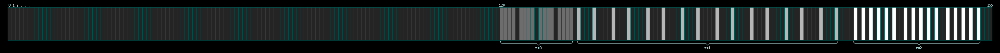
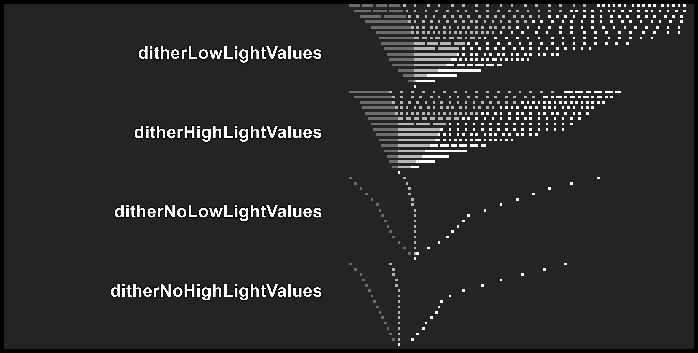

# Dither pattern generator and documentation

## Purpose
The GameBoy Camera uses various dither patterns to convert analog greyscale images received by it's sensor to 2-bit greyscale images which is the common image format across gameboys.  
This repository aims to explain how the original patterns have been created and also provides tools to create alternative patterns.  
The generation of new patterns is meant to be done programmatically via parameters defining a pattern

## Original patterns
The original patterns consist of four groups with 16 patterns each. The four groups being for high and low light conditions with dithering on and off.  
For example the first pattern from the "Low light/dithering" set looks like this:
```javascript
[
  [[128, 148, 220], [143, 202, 246], [131, 161, 226], [146, 215, 252]],
  [[138, 184, 237], [133, 166, 228], [141, 197, 244], [136, 179, 235]],
  [[130, 157, 224], [145, 211, 250], [129, 152, 222], [144, 206, 248]],
  [[140, 193, 241], [135, 175, 233], [139, 188, 239], [134, 170, 230]],
]
```

They can be viewed as a three dimensional array with the dimensions as follows:
```javascript
[
  [["↘", "z", "z"], ["y", "", ""], ["y", "", ""], ["y", "", ""]],
  [["x",  "",  ""], [ "", "", ""], [ "", "", ""], [ "", "", ""]],
  [["x",  "",  ""], [ "", "", ""], [ "", "", ""], [ "", "", ""]],
  [["x",  "",  ""], [ "", "", ""], [ "", "", ""], [ "", "", ""]],
]
```
`x` and `y` are the coordinates in the 4x4 area to which the pattern is applied.  
`z` defines the thresholds for the three greyscales (black/dark grey/light grey/white).

All original dithering sets [are here for reference](reference/patterns.js).

## Analysis of the patterns to get the "base values"
The initial analysis aimed to create a visible representation of a pattern. For this - as pointed out by [github.com/hatchman](https://github.com/hatchman) - the best approach was to separate and sort the values of each z-layer.  
This "looses" the actual pattern and results in three _non overlapping_ sequences:
```javascript
const z0 = [128, 129, 130, 131, 133, 134, 135, 136, 138, 139, 140, 141, 143, 144, 145, 146]; // 128 to 146
const z1 = [148, 152, 157, 161, 166, 170, 175, 179, 184, 188, 193, 197, 202, 206, 211, 215]; // 148 to 215
const z2 = [220, 222, 224, 226, 228, 230, 233, 235, 237, 239, 241, 244, 246, 248, 250, 252]; // 220 to 252
```

These three sequences can be plotted like this (click to enlarge):  
[](doc/single_pattern.png)

This can be done with all four groups:
[](doc/patterns.png)

This process visualizes that each of the three sequences of each pattern is a linear distribution of the 16 values.  
The slight deviations are due to the values being _rounded down_ to a full integer.

The first six patterns of the `ditherLowLightValues` group have the last group cut off at exactly 255. The slight "gap" to the end originates from the calculation of the linear distibution where the step size is calculated for 16 steps _ongoing from_ the first value.  
_This approach will be used here to exactly reproduce the values of the original patterns._  
The [`generateValueRange` function](src/generateBaseValues.js) for creating each sequence uses this approach.  

Through using the first value of each pattern's sequences and manually trying for the last value, the [required boundaries for all four original patterns](src/data/patternBases.js) could be determined (this file also contains additional custom sequences). 

## Ordering the generated sequences to create the actual dither pattern.
Having linear sequences does not create an aesthetically pleasing image. So each of the three sequences (z-dimension) are arranged into a [Bayer matrix threshold map](https://en.wikipedia.org/wiki/Ordered_dithering).  
The two non-dithering sets are only using the first value of the sequences.  
The [ordering matrix](src/data/orderPatterns.js) to create the paterns are used by [the `generatePattern` function](src/generatePattern.js) which re-assembles and finalizes the usable dithering pattern. 

## Thanks
* [github.com/hatchman](https://github.com/hatchman) for giving me the idea to sort the values to spot a pattern
* The [GameBoy Camera Clup Discord](https://discord.gg/C7WFJHG) for a lot of inspiration and countless ideas
